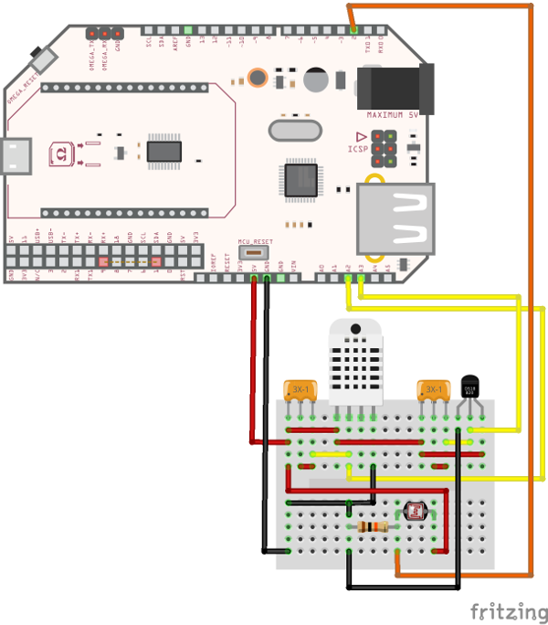
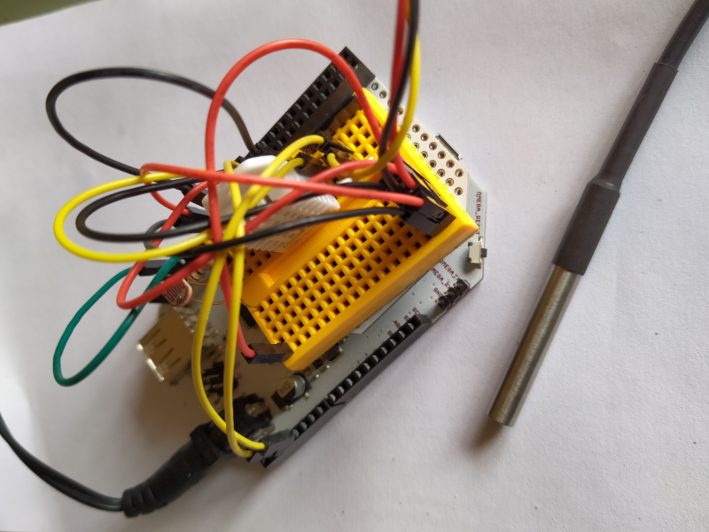

# Onion Omega 2+ demo

This repository shows how to read sensors with an Onion Omega2+ with an Arduino 
dock, and how to expose the values as a JSON API with PHP.

## Prerequisites

A working Onion Omega2+ with Arduino:

  * The Omega must be properly configured
  * It must run PHP on uhttpd
  * The Arduino can be flashed over WiFi

There are some instructions [here](https://github.com/sixty-nine/onion-omega2). But
the official doc is your best friend.

## Hardware

### Components

This project uses:

 * a photocell to detect ambien light 
 * a DHT22 to read temperature and humidity
 * a Dallas Temperature sensor to read external temperature

### Schematics
 
Please follow the schematics from the components. Here is an example.



In short:
 * the photocell has a 10kΩ pull-down resistor and
 * the DHT and the Dallas a 5kΩ pull-up resistor

The photocell is connected to analog pin 1, the DHT and the Dallas
to digital pins 2, resp. 3.

Hopefully you can be less messy than me :)


 
## Usage

 * Upload the `arduino` sketch.
 * Upload the `api` to the web server (the root must point to the `www` directory)
 * Call `http://omega:8080/index.php/sensors?id=0` in a browser

### Debugging on serial line

```bash
ssh root@omega
screen /dev/ttyS1 9600
```

Send:
 * `0` to get all the sensors
 * `1` for the values of the photocell
 * `2` for the values of the DHT22
 * `3` for the values of the Dallas Temperature sensor
 

### Example uhttpd config

```
config 'uhttpd' 'api'
    option listen_http '8080'
    option listen_https '8081'
    option 'home'        '/home/dev/omega-api/www'
    list interpreter ".php=/usr/bin/php-cgi"
    option index_page 'index.php'
    option cert '/etc/uhttpd.crt'
    option key '/etc/uhttpd.key'
```

## Modifying the code

### Arduino

You probably know more than me about C++.

### PHP

You will need to install PHP mods on the Omega. Your task will be to find out which one :)

Technically `composer` can run on the Omega2 with few hacks. In real, it's extremely
slow. I'd advice you to execute it on your host, and then upload the whole to the Omega.